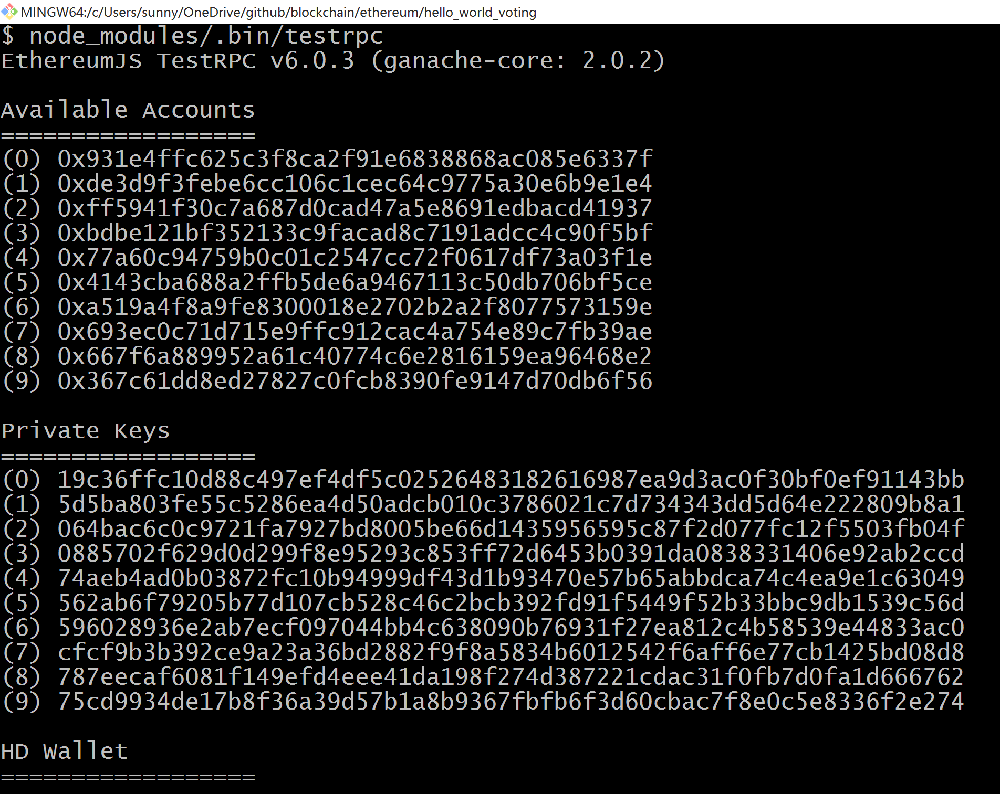

第一个Dapp：Hello World Voting
-------------------------------

1. 在工作目录：
```Bash
> mkdir hello_world_voting
```

相关工具版本：


2. 安装testRPC和web3
```Bash
> npm install ethereumjs-testrpc web3@0.20.1
```

3. 启动testRPC服务
```Bash
> node_modules/.bin/testrpc
```
如果服务成功启动，运行如下：



可以看到，testrpc创建了10个测试账户，每个账户都有100个ethers

4. 编写contract

简单的[Voting](./Voting.sol)代码 

5. 安装solc
```Bash
> npm install solc
```
6. 使用web3与blockchain交互
```javascript
sunny@DESKTOP-UTTEQTU MINGW64 ~/OneDrive/github/blockchain/ethereum/hello_world_voting (master)$ node
> Web3 = require('web3')
> web3 = new Web3(new Web3.providers.HttpProvider("http://localhost:8545"));  #使用server地址初始化Web3
```

第一次与blockchain交互：
```javascript
> web3.eth.accounts
[ '0x931e4ffc625c3f8ca2f91e6838868ac085e6337f',
  '0xde3d9f3febe6cc106c1cec64c9775a30e6b9e1e4',
  '0xff5941f30c7a687d0cad47a5e8691edbacd41937',
  '0xbdbe121bf352133c9facad8c7191adcc4c90f5bf',
  '0x77a60c94759b0c01c2547cc72f0617df73a03f1e',
  '0x4143cba688a2ffb5de6a9467113c50db706bf5ce',
  '0xa519a4f8a9fe8300018e2702b2a2f8077573159e',
  '0x693ec0c71d715e9ffc912cac4a754e89c7fb39ae',
  '0x667f6a889952a61c40774c6e2816159ea96468e2',
  '0x367c61dd8ed27827c0fcb8390fe9147d70db6f56' ]
```

编译contract：
```javascript
> code = fs.readFileSync('Voting.sol').toString()
> solc = require('solc')
> compiledCode = solc.compile(code)
```
**注意**：

a. compiledCode.contracts[‘:Voting’].bytecode: 将来部署到blockchain的执行code
b. compiledCode.contracts[‘:Voting’].interface: contract的接口(called [ABI](https://github.com/ethereum/wiki/wiki/Ethereum-Contract-ABI) 

部署contract：
```javascript
> abiDefinition = JSON.parse(compiledCode.contracts[':Voting'].interface)
> VotingContract = web3.eth.contract(abiDefinition)
> byteCode = compiledCode.contracts[':Voting'].bytecode
> deployedContract = VotingContract.new(['Rama','Nick','Jose'],{data: byteCode, from: web3.eth.accounts[0], gas: 4700000})
> deployedContract.address
> contractInstance = VotingContract.at(deployedContract.address)
```
**注意**：

a. data: 可执行代码被部署到blockchain
b. from: 为了可追溯的目的，需要提供账户，由于我们使用testrpc，因此这里不需要密码，否则密码是必须的
c. gas: 需要耗费的gas值，被奖励给矿工
d. deployedContract.address: 很关键，如果需要和部署的contract交互的时候，通过此地址即可找到目标contract

与部署好的contract交互：
```javascript
> contractInstance.totalVotesFor.call('Rama')
{ [String: '0'] s: 1, e: 0, c: [ 0 ] }
> contractInstance.voteForCandidate('Rama', {from: web3.eth.accounts[0]})
'0xdedc7ae544c3dde74ab5a0b07422c5a51b5240603d31074f5b75c0ebc786bf53'
> contractInstance.voteForCandidate('Rama', {from: web3.eth.accounts[0]})
'0x02c054d238038d68b65d55770fabfca592a5cf6590229ab91bbe7cd72da46de9'
> contractInstance.voteForCandidate('Rama', {from: web3.eth.accounts[0]})
'0x3da069a09577514f2baaa11bc3015a16edf26aad28dffbcd126bde2e71f2b76f'
> contractInstance.totalVotesFor.call('Rama').toString()
'3'
```

7. 与blockchain交互的Web页面

[index.html](./index.html)
[index.js](./index.js)

**注意**：
在step 6 提到过contract的部署地址很关键，这里需要更新一下[index.js](./index.js)，使用你的contract部署地址：
```javascript
contractInstance = VotingContract.at('0x26ce19747547179cfdcf7050f93a6a6f259d83dc');
```
完成之后，即可使用浏览器打开index.html来进行投票了，如果能够看到投票，并看到更新后的票数，那么恭喜你，第一个Dapp已经成功运行了


